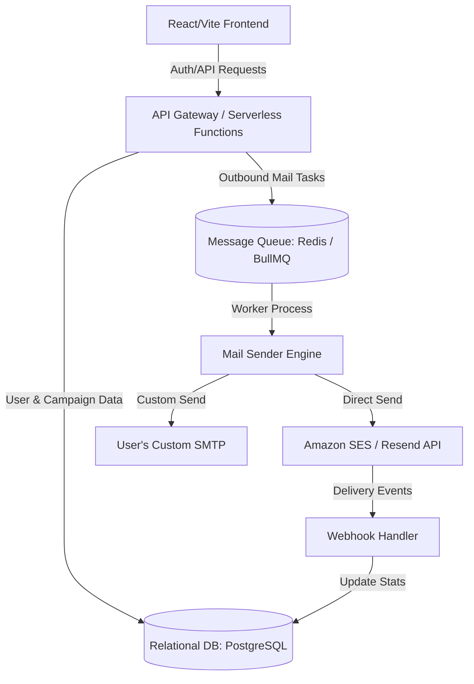

# Peak-X Sender: SaaS Transition Roadmap

Peak-X Sender is currently a powerful, fast, 100% client-side bulk email outreach tool. Transforming it into a **SaaS (Software-as-a-Service) product** requires upgrading it from a client-side utility to a cloud-based application with a backend, user authentication, direct sending capability, analytics, and billing.

Below is the proposed SaaS architecture and implementation roadmap.

---

## 1. Core Architectural Shifts
To support a multi-tenant SaaS model, we need to transition from the current client-side architecture to a **Full-Stack Architecture**:

---

## 2. Recommended SaaS Feature Upgrades

### A. Authentication & Database Sync
* **User Accounts**: Implement Secure Authentication (OAuth via Google, GitHub, Magic Links, and Email/Password) using services like **Supabase Auth**, **Clerk**, or **Auth0**.
* **Cloud Persistence**: Migrate template management and recipient lists from `localStorage` to a centralized cloud database (e.g., PostgreSQL). This enables users to access their templates and campaigns across multiple devices.

### B. Direct Server-Side Email Delivery (SMTP / API)
* **Current state**: Relies on opening individual `mailto:` browser windows.
* **SaaS Upgrade**:
  * **Built-in Delivery**: Deliver emails directly from the server using reliable API integrations (e.g., **Amazon SES**, **Resend**, **Postmark**, or **SendGrid**).
  * **Custom SMTP Integration**: Allow premium users to input their own SMTP credentials (Office365, Google Workspace, custom domains) so emails originate directly from their address.
  * **Rate Limiting & Warmups**: Implement queue managers (like BullMQ on Redis) to slowly dispatch bulk campaigns to prevent domain blacklisting.

### C. Campaign Analytics & Tracking (The "Value Add")
By routing delivery through a server, we can track key marketing metrics:
* **Open Rates**: Tracked via transparent 1x1 tracking pixels embedded in HTML emails.
* **Link Clicks**: Wrap URLs in redirect links to track which links recipients clicked.
* **Bounces & Complaints**: Register webhooks with the mail providers to automatically mark bounced or complained emails as invalid/unsubscribable in the user's database.

### D. Automated Sequences & Drip Campaigns
* Allow users to build "outreach flows" (e.g., Send Email 1 -> Wait 3 Days -> If no reply, Send Email 2).
* Automated unsubscribe headers/links to keep emails compliant with CAN-SPAM and GDPR.

---

## 3. Monetization & Stripe Integration
To operate as a SaaS, a billing gateway like **Stripe** or **Lemon Squeezy** is required:

| Plan | Pricing | Features Included |
| :--- | :--- | :--- |
| **Free** | $0/mo | Up to 100 emails/month, client-side only, standard templates. |
| **Starter** | $19/mo | Direct sending (up to 5,000/mo), basic analytics, custom templates. |
| **Pro** | $49/mo | Direct sending (up to 50,000/mo), custom SMTP, open/click tracking, drip sequences. |
| **Enterprise** | Custom | Dedicated IP pools, team workspaces, CRM integrations (HubSpot, Salesforce). |

---

## 4. Immediate Development Roadmap (Phase 1)
To build a Minimum Viable SaaS Product (MVSP) quickly:

1. **Backend Integration**: Implement a database layer (e.g., Supabase or Firebase) to save templates and histories.
2. **SMTP Integration Form**: Add a profile setting where users can enter their custom SMTP credentials.
3. **Send API Handler**: Create a secure endpoint that accepts the recipient list, subject, and body, dynamically compiles variables, and sends emails through the user's SMTP credentials rather than opening browser mailto tabs.
